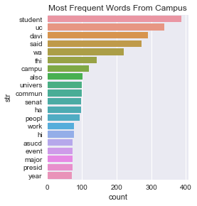
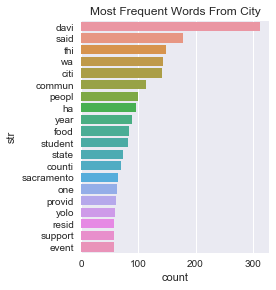
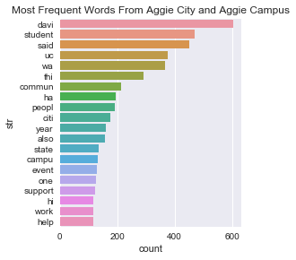
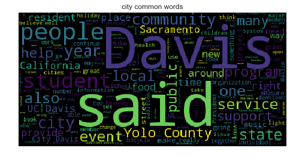
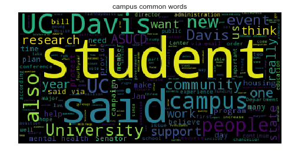
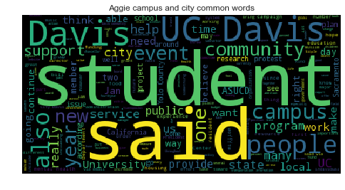

In this project, we'll scrape text from [The California Aggie](https://theaggie.org/) and then analyze the text and figure out the hot topics in Campus New and Sport of the California Aggie.


```python
def get_link_recursively(url, Total_Page,url_List= None):
    """function extracts all article links on from a given base url"""
    """input: base url, total page we are getting"""
    """output: url for list of artitle for given number of page"""
    if url.count('/')==4:
        url_end = url+'page/'+str(Total_Page)
        if requests.head(url_end).status_code==404:
            return 'Total_Page number exceeds max limits'
            
    clim= BeautifulSoup(requests.get(url).text,'html.parser')
    Artical_Title = clim.find_all(name = 'h2',attrs ={"class" : "entry-title"} )    
    if url_List == None:
        url_List = []
      
    next_page_url = clim.find_all('a', class_ = "page-numbers")
    url = next_page_url[-1].get('href')
    for a in Artical_Title:
         url_List.append(str(a.find_all('a')[0]['href'].strip()))
    if Total_Page != 1:
        return get_link_recursively(url, Total_Page-1,url_List)
    else: #total  = 1 
        return url_List
```


```python
def dictReturn(Artical_Url):
    """function extracts the title, text, and author from an Aggie article."""
    """input: one url in string format""" 
    """output: dictionary with key: arthur(in unicode), text(in unicode), titile(in str format), url)"""
    clim = BeautifulSoup(requests.get(Artical_Url).text,'html.parser') 
    collset_content = clim.find_all(name='div',attrs ={"itemprop" : "articleBody"})

    #arthur
    arthur = collset_content[0].find_all(name='p')[-1].text.translate({ 0x2018:0x27, 0x2019:0x27, 0x201C:0x22, 0x201D:0x22, 0x2026:0x20 })
    arthur = arthur[arthur.lower().find('written by'):]
    if len(arthur)<2:
        collset_content_arthur = clim.find_all(name='strong')
        for content in collset_content_arthur:
            if content.text.lower().find('written by') != -1:
                arthur=content.text[content.text.lower().find('written by'):]
            else:
                arthur = 'None'
    #body
    body_content = collset_content[0].find_all(name='p')[:-1]
    body_txt = ''.join([sentence.text for sentence in body_content]).translate({ 0x2018:0x27, 0x2019:0x27, 0x201C:0x22, 0x201D:0x22, 0x2026:0x20 })
    
    #title
    title_content = clim.find_all(name='h1',attrs ={"class" : "entry-title"})
    title = title_content[0].text.translate({ 0x2018:0x27, 0x2019:0x27, 0x201C:0x22, 0x201D:0x22, 0x2026:0x20 })
    title = title.encode('ascii','ignore')
    
    adict = {'author':[], 'text':[], 'title':[], 'url':[]}
    adict['author']=arthur
    adict['text']= body_txt
    adict['title'] = title
    adict['url'] = Artical_Url
    return adict
```


```python
url= 'https://theaggie.org/city/'
result_city = get_link_recursively(url, Total_Page = 4)
url= 'https://theaggie.org/campus/'
result_campus = get_link_recursively(url, Total_Page = 4)

#city
result_city_df = pd.concat([pd.DataFrame([dictReturn(result_city[i])]) for i in xrange(len(result_city))])
result_city_df = result_city_df.reset_index(drop=True)
result_city_df['category'] = 'City News'
print result_city_df.shape

#campus
result_campus_df = pd.concat([pd.DataFrame([dictReturn(result_campus[i])]) for i in xrange(len(result_campus))])
result_campus_df = result_campus_df.reset_index(drop = True)
result_campus_df['category'] = 'Campus News'
print result_campus_df.shape

#concate
Campus_City_df = result_campus_df.append(result_city_df).reset_index(drop = True)
print Campus_City_df.shape
Campus_City_df.head()
```

    (60, 5)
    (60, 5)
    (120, 5)


<div>
<table border="1" class="dataframe">
  <thead>
    <tr style="text-align: right;">
      <th></th>
      <th>author</th>
      <th>text</th>
      <th>title</th>
      <th>url</th>
      <th>category</th>
    </tr>
  </thead>
  <tbody>
    <tr>
      <th>0</th>
      <td>Written by: Alyssa Vandenberg  — campus@theagg...</td>
      <td>Six senators, new executive team electedCurren...</td>
      <td>2017 Winter Quarter election results</td>
      <td>https://theaggie.org/2017/02/24/2017-winter-qu...</td>
      <td>Campus News</td>
    </tr>
    <tr>
      <th>1</th>
      <td>Written by: Aaron Liss and Raul Castellanos  —...</td>
      <td>Wells Fargo faces fraud, predatory lending cha...</td>
      <td>University of California, Davis City Council s...</td>
      <td>https://theaggie.org/2017/02/23/university-of-...</td>
      <td>Campus News</td>
    </tr>
    <tr>
      <th>2</th>
      <td>Written by: Kimia Akbari — campus@theaggie.org</td>
      <td>Faculty, students recount personal tales of im...</td>
      <td>Academics unite in peaceful rally against immi...</td>
      <td>https://theaggie.org/2017/02/23/academics-unit...</td>
      <td>Campus News</td>
    </tr>
    <tr>
      <th>3</th>
      <td>Written by: Kenton Goldsby — campus@theaggie.org</td>
      <td>Opening date pushed back to May 1Students have...</td>
      <td>Memorial Union to reopen Spring Quarter</td>
      <td>https://theaggie.org/2017/02/23/memorial-union...</td>
      <td>Campus News</td>
    </tr>
    <tr>
      <th>4</th>
      <td>Written by: Ivan Valenzuela — campus@theaggie.org</td>
      <td>Veto included revision abandoning creation of ...</td>
      <td>ASUCD President Alex Lee vetoes amendment for ...</td>
      <td>https://theaggie.org/2017/02/23/asucd-presiden...</td>
      <td>Campus News</td>
    </tr>
  </tbody>
</table>
</div>


# What topics does the Aggie cover the most? Do city articles typically cover different topics than campus articles?


```python
def Df_to_FreqGrap(result_city_df,data_from):
    """function that plots word frequency after filtering out stop word and conduct lemmatize"""
    """input: dataframe with text in column name text, and a string specify where do data come from (i.e title for the graph)"""
    """output: barplot for the top 20 frequent lemmatized words """
    Final_word_list =[]
    asking= ''.join(result_city_df['text'])
    asking[2]
    asking = "".join(l for l in asking if l not in string.punctuation)
    word_list  = asking.split(' ')
    for i in range(0,len(word_list)):
        if len(lemmatize(word_list[i]))>0:
            Final_word_list.append(lemmatize(word_list[i])[0])
    filtered_words = [word for word in Final_word_list if word not in stopwords.words('english')]  
    c=Counter(filtered_words).most_common(20)
    a = pd.DataFrame(c)
    list(a)
    a = a.rename(columns = {0:'str', 1:'count'})
    sns.factorplot('count','str',  data = a, kind = "bar")
    sns.plt.title('Most Frequent Words'+ ' ' + data_from)
    plt.show()  

```


```python
stemmer = PorterStemmer().stem
tokenize = nltk.word_tokenize
def stem(tokens,stemmer = PorterStemmer().stem):
    return [stemmer(w.lower()) for w in tokens] 
def lemmatize(text):
    return stem(tokenize(text))

def df_wordCloud_graph(Campus_City_df,title):
    """function plot word cloud after filtering out stopwords,without limmetization"""  
    """input:dataframe , title on the plot"""
    """output: word cloud plot """
    asking= ''.join(Campus_City_df['text']).encode('ascii','ignore')
    asking = "".join(l for l in asking if l not in string.punctuation)
    word_list  = asking.split(' ')
    filtered_words = [word for word in word_list if word not in stopwords.words('english')]
    len(filtered_words)
    text = ' '.join(filtered_words)
    wordcloud = WordCloud().generate(text)
    plt.imshow(wordcloud)
    plt.axis("off")
    plt.title(title)
    plt.show()
```


```python
Df_to_FreqGrap(result_campus_df,'From Campus')
Df_to_FreqGrap(result_city_df,'From City')
```








```python
Df_to_FreqGrap(Campus_City_df,'From Aggie City and Aggie Campus')
```





```python
df_wordCloud_graph(result_city_df,'city common words')
df_wordCloud_graph(result_campus_df,'campus common words')

```








```python
df_wordCloud_graph(Campus_City_df,'Aggie campus and city common words')
```





# Comment
Based on Aggie City and Aggie Campus, the Californa Aggies covers mostly life about events  Davis, students and community. The most frequent words for campus news is about apparently about studnets and campus, the univeristy appears also frequently. Since asucd senate election happened recently, which in the time period in which our news are from, so senate and asucd are frequent words in our campus artile,but not in city. The ,ost frequent words for aggie city news is davis,city, and community. In aggie city new, some words like, state, yolo, and sacromenta are not common in aggie campus

Moreover, based on similarity matrix, I won't say there is a big difference in aggie city and aggie campus. I calculate the average article similartiy for articles from aggie campus only, from aggie city only, from article vs city only. The similarity index between articles within city article is even smaller than similarity index between article across city article and campus article. But similarity index is higher in aggie campus than comparison across type. 

Therefor I conclude, there different topics in campus article, but the difference is not huge


# Titles of the top 3 pairs of most similar articles. What words do they have in common?


```python
pos_List = []
sim_copy = sim.copy()
for i in range(0,120):
    sim_copy[i,i]=0
for i in range(0,3):
    k,j = np.unravel_index(sim_copy.argmax(), sim_copy.shape)
    print 'value',sim_copy[k,j],'position is:',k,j
    sim_copy[k,j]=0
    sim_copy[j,k]=0
    pos_List.append(k)
    pos_List.append(j)

print Campus_City_df.ix[pos_List,:]['title']   
```

    value 0.709003734481 position is: 14 35
    value 0.637798589665 position is: 51 58
    value 0.622394799546 position is: 24 38
    14        UC Davis holds first mental health conference
    35    UC Davis to host first ever mental health conf...
    51            Protests erupt at Milo Yiannopoulos event
    58    Davis College Republicans club leads protest a...
    24    University of California Regents meet, approve...
    38     UC Regents vote to raise tuition for UC campuses
    Name: title, dtype: object


```python
def filterWords(txt):
    txt = "".join(l for l in txt if l not in string.punctuation)
    word_list  = txt.split(' ')
    Final_word_list =[]
    for i in range(0,len(word_list)):
        if len(lemmatize(word_list[i]))>0:
            Final_word_list.append(lemmatize(word_list[i])[0])
    filtered_words = [word for word in Final_word_list if word not in stopwords.words('english')]
    return filtered_words

def common_word(file_num_1,file_num_2,df):
    txt1 = set(filterWords(df['text'][file_num_1]))
    txt2 = set(filterWords(df['text'][file_num_2]))
    return list(txt1 & txt2)
```


```python
print 'There are',len(common_word(14,35,Campus_City_df)),'of words(besides stopwords) in common for file 14 and 35, these are :'
print common_word(14,35,Campus_City_df),'\n'

print 'There are',len(common_word(51,58,Campus_City_df)),'of words(besides stopwords) in common for file 51 and 58, these are :'
print common_word(14,35,Campus_City_df), '\n'

print 'There are',len(common_word(24,38,Campus_City_df)),'of words(besides stopwords) in common for file 24 and 38, these are :'
print common_word(14,35,Campus_City_df) ,'\n'

```

    There are 99 of words(besides stopwords) in common for file 14 and 35, these are :
    [u'help', u'founder', u'text', u'month', u'involv', u'group', u'lgbtqia', u'monica', u'break', u'psychologist', u'tri', u'administr', u'organ', u'gender', u'panelist', u'crisi', u'two', u'prevent', u'set', u'mental', u'realli', u'close', u'beyond', u'juliet', u'spiritu', u'abl', u'health', u'approach', u'porter', u'full', u'wa', u'confer', u'destigmat', u'bodi', u'host', u'base', u'come', u'panel', u'thirdyear', u'remark', u'attende', u'place', u'advocaci', u'studi', u'disabl', u'first', u'major', u'three', u'right', u'opportun', u'open', u'select', u'use', u'feb', u'spoke', u'commun', u'suicid', u'workshop', u'advoc', u'includ', u'pm', u'offer', u'forb', u'heal', u'took', u'fund', u'line', u'davi', u'counsel', u'work', u'aim', u'nine', u'psycholog', u'uc', u'150', u'engag', u'applic', u'process', u'want', u'onlin', u'secur', u'perform', u'speaker', u'peopl', u'9', u'attend', u'samantha', u'english', u'director', u'said', u'plan', u'student', u'center', u'well', u'person', u'thi', u'choos', u'chiang', u'academ'] 
    
    There are 75 of words(besides stopwords) in common for file 51 and 58, these are :
    [u'help', u'founder', u'text', u'month', u'involv', u'group', u'lgbtqia', u'monica', u'break', u'psychologist', u'tri', u'administr', u'organ', u'gender', u'panelist', u'crisi', u'two', u'prevent', u'set', u'mental', u'realli', u'close', u'beyond', u'juliet', u'spiritu', u'abl', u'health', u'approach', u'porter', u'full', u'wa', u'confer', u'destigmat', u'bodi', u'host', u'base', u'come', u'panel', u'thirdyear', u'remark', u'attende', u'place', u'advocaci', u'studi', u'disabl', u'first', u'major', u'three', u'right', u'opportun', u'open', u'select', u'use', u'feb', u'spoke', u'commun', u'suicid', u'workshop', u'advoc', u'includ', u'pm', u'offer', u'forb', u'heal', u'took', u'fund', u'line', u'davi', u'counsel', u'work', u'aim', u'nine', u'psycholog', u'uc', u'150', u'engag', u'applic', u'process', u'want', u'onlin', u'secur', u'perform', u'speaker', u'peopl', u'9', u'attend', u'samantha', u'english', u'director', u'said', u'plan', u'student', u'center', u'well', u'person', u'thi', u'choos', u'chiang', u'academ'] 
    
    There are 39 of words(besides stopwords) in common for file 24 and 38, these are :
    [u'help', u'founder', u'text', u'month', u'involv', u'group', u'lgbtqia', u'monica', u'break', u'psychologist', u'tri', u'administr', u'organ', u'gender', u'panelist', u'crisi', u'two', u'prevent', u'set', u'mental', u'realli', u'close', u'beyond', u'juliet', u'spiritu', u'abl', u'health', u'approach', u'porter', u'full', u'wa', u'confer', u'destigmat', u'bodi', u'host', u'base', u'come', u'panel', u'thirdyear', u'remark', u'attende', u'place', u'advocaci', u'studi', u'disabl', u'first', u'major', u'three', u'right', u'opportun', u'open', u'select', u'use', u'feb', u'spoke', u'commun', u'suicid', u'workshop', u'advoc', u'includ', u'pm', u'offer', u'forb', u'heal', u'took', u'fund', u'line', u'davi', u'counsel', u'work', u'aim', u'nine', u'psycholog', u'uc', u'150', u'engag', u'applic', u'process', u'want', u'onlin', u'secur', u'perform', u'speaker', u'peopl', u'9', u'attend', u'samantha', u'english', u'director', u'said', u'plan', u'student', u'center', u'well', u'person', u'thi', u'choos', u'chiang', u'academ'] 
    
# Comment

This corpus is not a representative of aggie. Aggie has more aspect that just city and campus, for example, art, sport, etc. Moreover, and I only looked at 120 articles. The link online is sort by news release time,  which means the 120 articles are the most recent 120 article aggie news released, i.e. our analysis result is based on recent events. 


[back](../)
