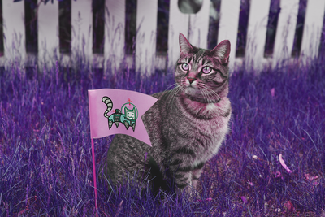
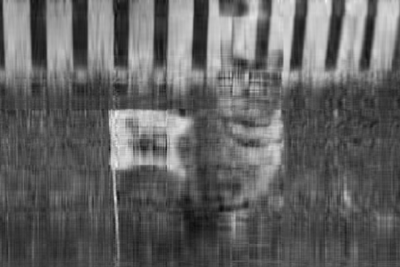

## Image Processing Basics

Computers use tiny dots called _pixels_ to display images. Each pixel is stored as an array of numbers that represent color intensities.

In an 8-bit grayscale image, each pixel is a single number. The number represents light intensity ranging from black (0) to white (255). In a 24-bit RGB color image, each pixel is an array of 3 numbers. These numbers range from 0 to 255 and represent red, green, and blue intensity, respectively. For instance, `(0, 0, 255)` is <span style="color:#00F">bright blue</span> and `(255, 128, 0)` is <span style="color:#FF8000">orange</span>.

In this project, I'll use Python and NumPy to manipulate 24-bit RGB color images.


```python
from PIL import Image
# Cat image from https://unsplash.com/photos/FqkBXo2Nkq0
cat_img = Image.open("cat.png")
cat_img
```


NumPy can convert images to arrays:


```python
import numpy as np
cat = np.array(cat_img)
```

To convert an array back to an image (for display) use the function below:


```python
def as_image(x):
    """Convert an ndarray to an Image.
    Args:
        x (ndarray): The array of pixels.
    Returns:
        Image: The Image object.
    """
    return Image.fromarray(np.uint8(x))
```


```python
cat.shape
```


    (267, 400, 3)


In this 'cat' array, we have 3 dimension. Each dimension represent a color channel . Picture consist of 267*400 pixels points, each pixel has 3 numbers representing the intensity of red(x-axis), green(y-axis) and blue(z-axis). 

If we want to swap the green(1) and blue(2) color channels in a copy. 


```python
BigCat = cat.copy()
BigCat[:,:,1] = cat[:,:,2]
BigCat[:,:,2] = cat[:,:,1]
def as_image(x):
    return Image.fromarray(np.uint8(x))
as_image(BigCat)
```





If we want to flip the blue(2) color channel from left to right. 


```python
Cat14 = cat.copy()
Cat14[:, :, 2] = np.fliplr(Cat14[:, :, 2])
Image.fromarray(np.uint8(Cat14))
```


## Singular Value Decomposition (compress picture size) 

Suppose $X$ is an $n \times p$ matrix (for instance, one color channel of the cat image). The _singular value decomposition_ (SVD) factors $X$ as $X = UD V^T$, where:

* $U$ is an $n \times n$ orthogonal matrix
* $D$ is an $n \times p$ matrix with zeroes everywhere except the diagonal
* $V$ is an $p \times p$ orthogonal matrix

Note that a matrix $A$ is _orthogonal_ when $A^T A = I$ and $AA^T = I$.

If we let

* $u_i$ denote the $i$th column of $U$
* $d_i$ denote the $i$th diagonal element of $D$
* $v_i$ denote the $i$th column of $V$

then we can write the SVD as $\ X = UDV^T = d_1 u_1 v_1^T + \ldots + d_m u_m v_m^T\ $ using the rules of matrix multiplication. In other words, the SVD decomposes $X$ into a sum!

If we eliminate some of the terms in the sum, we get a simple approximation for $X$. For instance, we could eliminate all but first 3 terms to get the approximation $X \approx d_1 u_1 v_1^T + d_2 u_2 v_2^T + d_3 u_3 v_3^T$. This is the same as if we:

* Zero all but the first 3 diagonal elements of $D$ to get $D_3$, then compute $X \approx UD_3V^T$
* Eliminate all but the first 3 columns of $V$ to get $p \times 3$ matrix $V_3$, then compute $X \approx UDV_3^T$

We always eliminate terms starting from the end rather than the beginning, because these terms contribute the least to $X$.

Why would we want to approximate a matrix $X$?

In statistics, _principal components analysis_ uses this approximation to reduce the dimension (number of covariates) in a  centered (mean 0) data set. The vectors $d_i u_i$ are called the _principal components_ of $X$. The vectors $v_i^T$ are called the _basis vectors_. Note that both depend on $X$. The dimension is reduced by using the first $q$ principal components instead of the original $p$ covariates. In other words, the $n \times p$ data $X$ is replaced by the $n \times q$ data $UD_q = XV_q$

In computing, this approximation is sometimes used to reduce the number of bits needed to store a matrix (or image). If $q$ terms are kept, then only $nq + pq$ values (for $XV_q$ and $V_q^T$) need to be stored instead of the uncompressed $np$ values.

## __Application__:

What's the smallest number of terms where the cat is still recognizable as a cat?
How many bytes does the red color channel of the cat image use? How many bytes does the compressed version use when 10 terms are kept? What percentage of the original size is this?


```python
def fun1(Red,q):
    """ Function takes Red(matrix X) and number of terms kept K 
        Apply SVD decompostion
        Return XVq and basis VqT
    """
    u, d, vt = np.linalg.svd(Red) 
    return Red.dot(vt[0:q,:].T),vt[0:q,:] 

def fun2(XVq,VqT):
    """
    Function takes the output from funciton1, apply dot product to return the approx X 
    """
    return XVq.dot(VqT)
```


```python
import numpy as np
Red = cat[:,:,0]
q=13
Image.fromarray(np.uint8(fun2(*fun1(Red,q))))
```





```python
p=10
print round(float(fun1(Red,p)[0].nbytes+fun1(Red,p)[1].nbytes)/(float(Red.nbytes)),3)*100
print round(float(fun1(Red,p)[0].nbytes+fun1(Red,p)[1].nbytes)/(float(Red.nbytes)*8),3)*100

```

    50.0
    6.2


__Comment: __ I asked my roommate what can she sees from the picture without giving her any information about the picture. She recognized a cat with a flag when I set q to be 13. So approximately 13 is the smallest number of terms where the cat is still recognizable as a cat, but different people may have slightly different imagination. Red color channel of the cat image use 106800 bytes of int8 entries. The compressed version use when 10 terms are kept has total of 53360 bytes of float64 entries. If we do NOT take the entries type difference into consideration, the compression version is around 50% of the original size. If we take entries type difference into consideration, and say if we save all of the int8 entries of Red color channel as float64 entries, the compression version is around 6.24% of the Red color matrix.


```python

```
