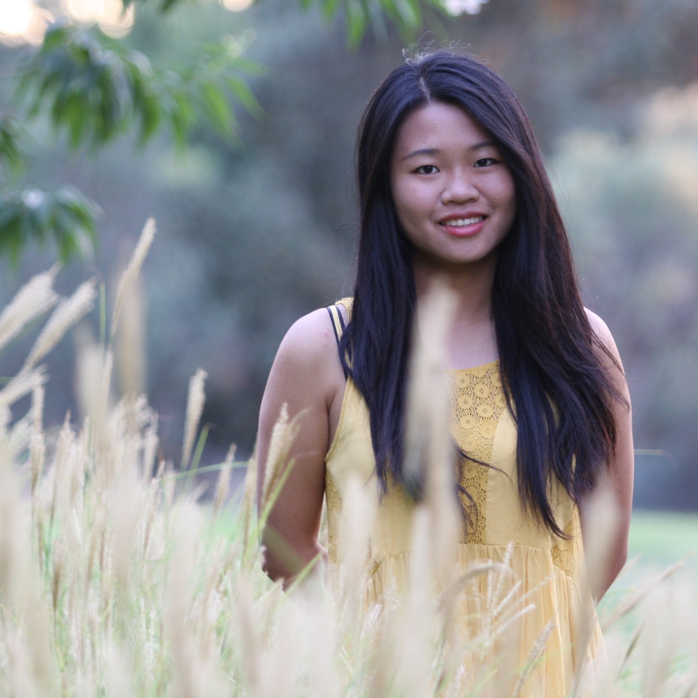

## About me.

 My name is Yanlin Li, also go by Alice. I am a master student in Statistics at University of California, Davis. I also graduated from Davis in 2016 with a B.S degree in both Applied Math and Statistics.

At UC Davis, I have taken coursework in math, statistics, computer programing and economics. These include classes such as Numerical Analysis, Time Series Analysis, Regression Analysis, Mathematical Finance, and Machine Learning algorithms. I primarily write code in R. I have also had programing experience in Matlab, C, SQL, SAS, and C++. I am currently learning how to conduct data analysis in Python. 

My goal is to become a data analyst or data scientist after graduation. Below you will find some of the data analysis projects I have done in and outside of classes in the past, as well as my current project.  

-   [Compute Day of the Week for Any Given Date](md_Week)
-   [Image Process](CatImage/md_cat)
-   [Most Frequent Topics in Aggie News](AggieNews/AggieNews)
-   _Find Most Nutritious and Economical Food (Under Construction)_
-   Recent Project (Winter 2017 STA141B Group Project)
    - [Selection of Crops to Grow in San Joaquin Valley](https://zoeyyizhou.github.io/141BProject/)

<dl>
<dt>Contact</dt>
<dd><a href="https://www.linkedin.com/in/liyanlinalice/"> Alice on LinkedIn </a></dd>
<dd><a href="mailto:liyanlinalice@hotmail.com"> Email Alice </a></dd>
</dl>
