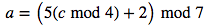
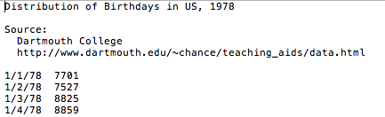

We will use the Doomsday Algorithm to solve this problem. The Doomsday algorithm, devised by mathematician J. H. Conway, computes the day of the week any given date fell on. The algorithm is designed to be simple enough to memorize and use for mental calculation.

The algorithm is based on the fact that for any year, several dates always fall on the same day of the week, called the <em style="color:#F00">doomsday</em> for the year. These dates include 4/4, 6/6, 8/8, 10/10, and 12/12. For example, the doomsday for 2016 is Monday, so in 2016 the dates above all fell on Mondays. The doomsday for 2017 is Tuesday, so in 2017 the dates above will all fall on Tuesdays.

Doomsday for the target year can be computed with the formula:


The result <em style="color:#F00"> d </em>  corresponds to a day of the week, starting with 0 for Sunday and ending with 6 for Saturday. <em style="color:#F00"> a </em>  is called the <em style="color:#F00">anchor day</em> for that century. It is the doomsday for the first year in a century.
 <em style="color:#F00"> y </em>  is the last two digits of the target year. The anchor day for a century <em style="color:#F00"> c </em>  can be computed with the formula:




The result <em style="color:#F00"> a </em> corresponds to a day of the week, starting with 0 for Sunday and ending with 6 for Saturday.


```python
def anchor(year):
    """function that accepts a year as input and computes the anchor day for that year's century."""
    century = year/100
    return (5*(century%4)+2)%7

print('1990 anchor year is:',anchor(1990))
```

    ('1990 anchor year is:', 3)


```python
import math
def doomsday(year):
    """"function that accepts a year as input and computes the doomsday for that year."""
    a=anchor(year)
    y=int(str(year)[len(str(year))-2:])
    d=int((math.floor(y/4)+y+a))%7
    return d
print('year is 1954; doomsday is',doomsday(1954))
```

    ('year is 1954; doomsday is', 0)


```python
def DayofWeek(month,day,year):
    """ideas: count the number of days between the target date and a nearby doomsday, modulo 7."""
    """"return day of the week for a given date in month,day,year format"""
    
    domday = doomsday(year)
    bigmonth=[1,3,5,7,8,10,12]
    smallmonth=[4,6,9,11]
    doomsdaydictRegu = {x+1:[10,28,21,4,9,6,11,8,5,10,7,12][x] for x in range(12)}
    doomsdaydictLeap = {x+1:[11,29,21,4,9,6,11,8,5,10,7,12][x] for x in range(12)}

    #if year%4==0:  
    if (year % 4 == 0 and year % 100 <> 0) or year % 400 == 0: #leap
        #print("lip")
        n = int((doomsdaydictLeap[month]-day)%7 )   

    else:  #regular
        #print("normal")
        n = int((doomsdaydictRegu[month]-day)%7 )
        
    if  n>0:
        if n> domday: 
            weekdate = domday+7-n        
        else: #if n>domday 
            weekdate = domday-n
    else: #if n>0 
        weekdate = (domday+n)%7
           
    weekdict ={x:['Sunday','Monday','Tuesday','Wednesday','Thursday','Friday','Saturday'][x] for x in range(7)}
    return(weekdict[weekdate])

print('Format: month,day,year')
print('1,2,2017',DayofWeek(1,2,2017))
```

    Format: month,day,year
    ('1,2,2017', 'Monday')


# Some Applications 

__1__.  How many times did Friday the 13th occur in the years 1900-1999?


```python
def times(Centuries):
    """"return the number of occurance of Friday13th in given century"""
    Count = 0
    for years in range (Centuries*100,(Centuries+1)*100):
        for months in range (1,13): 
            if DayofWeek(months,13,years)=="Friday":
                #print(months,13,years)
                Count = Count +1
    return(Count)
print("19th centuries has Friday13th occurs",times(19),'times')
```

    ('19th centuries has Friday13th occurs', 172, 'times')


__2__. How many times did Friday the 13th occur between the year 2000 and today?


```python
Count=0
for years in range (2000,2017):
       for months in range (1,13): 
            if DayofWeek(months,13,years)=="Friday":
                #print(months,13,years)
                Count = Count +1
print("Between the year 2000 and today, Friday13th occurs",Count+1,'times') 
```

    ('Between the year 2000 and today, Friday13th occurs', 30, 'times')


__3.__ The file `birthdays.txt` contains the number of births in the United States for each day in 1978. Which month had the most births in 1978? Which day of the week had the most births? Which day of the week had the fewest? What conclusions can you draw? 


Screen shot of the 'birthdays.txt'
```python
from PIL import Image
Image.open("ScreenShot_data.png")
```




```python
def read_birthdays(file_path):
    """Read the contents of the birthdays file into a string.
    Returns:
        string: The contents of the birthdays file.
    """
    with open(file_path) as file:
        return file.read()
```


```python
def formating(TXT):
    """"return each line of data in list format [m,d,y,# of birth] for given raw txt"""
    TXT=TXT.strip( '\n' ).strip( '\t' ).strip('')
    TXT = TXT[TXT.find('1/'):]
    TXT= TXT.split("\n")
    LongList = []
    for i in TXT:
        i=i.replace('/','\t')
        i = i.split("\t")
        if len(i)>3:
            LongList.append([int(ii) for ii in i])
    return LongList

#output the first line of data 
TXT = read_birthdays("birthdays.txt")
LongList = formating(TXT)
LongList[1]
```


    [1, 2, 78, 7527]


__Which month had the most/least births in 1978?__ 


```python
BirthByMonth=[None] * 12
for m in range(1,13):
    birth = 0 
    for i in LongList:
        if i[0] ==m:
            birth = birth+i[3]
    #print(m,birth)
    BirthByMonth[(m-1)]=birth
maxval = max(BirthByMonth)
minval = min(BirthByMonth)
ind_max = [i for i, v in enumerate(BirthByMonth) if v == maxval][0]
ind_min = [i for i, v in enumerate(BirthByMonth) if v == minval][0]
Monthdict ={x:['Jan','Feb','March','April','May','June','July','Aug','Sept','Oct','Nov','Dec'][x] for x in range(12)}
print("Max Month",Monthdict[ind_max])
print("Min Month",Monthdict[ind_min])
```

    ('Max Month', 'Aug')
    ('Min Month', 'Feb')


```python
weekdict ={x:['Sunday','Monday','Tuesday','Wednesday','Thursday','Friday','Saturday'][x] for x in range(7)}
BirthByWeek=[None] * 7
for w in range(7):
    birth = 0 
    for i in LongList: 
        if DayofWeek(i[0],i[1],i[2]+1900) == weekdict[w]:
            birth = birth+i[3]
    #print(w,birth)
    BirthByWeek[w]=birth

maxval = max(BirthByWeek)
ind = [i for i, v in enumerate(BirthByWeek) if v == maxval][0]
print("Max Day:",weekdict[ind])
minval = min(BirthByWeek)
ind = [i for i, v in enumerate(BirthByWeek) if v == minval][0]
print("Min Day:",weekdict[ind])

```

    ('Max Day:', 'Tuesday')
    ('Min Day:', 'Sunday')

__Conclusion__ We had the most babies bornt on August, and least in Feb in 1978. It might be the evoluntionary instinct that to have baby bornt in the fall and winter, as these are time of the yaer when food is more available, this gives offspring a better chance of surviving. We also had more babies bown on Tuesday, and least on Sunday. This may due to the fact that hospital is fully functional over the week, but not the weekend.  

[back](./)
